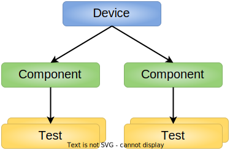
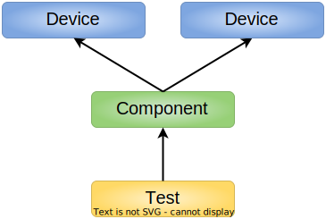

# Requirement Writing Deep Dive

The requirement writing guide provides tips for constructing a clear
and unambiguous requirement. It is designed to help authors
and reviewers of requirements.

## Background

The concept of writing requirements is quite simple to understand, but the devil
is in the details. This guide focuses on recognizing the many scenarios where
requirements are ambiguous, untestable, or difficult to trace.

### Why requirements?

A primary goal for requirements is to facilitate traceability between
requirements and tests.

Managing traceability enables us to confirm:

*   For my device, has every feature been implemented, tested, and is working?

It also enables us to answer thgit e reverse:

*   If my test fails, which features are impacted?

### Requirements are not read for pleasure

A good set of requirements tends to be dry and repetitive. That’s okay.

*“Nobody ever read a requirements document for pleasure. The purpose of the
document is not to be an entertaining read. The purpose is that each requirement
is correct and states as simply as possible what the system must do.”* 
*&mdash; Alistair Mavin, lead author of the
[The Easy Approach to Requirements Syntax](https://qracorp.com/easy-approach-to-requirements-syntax-ears-guide/).*

## Out of scope

The guide doesn’t cover:

*   Traceability theory, such as:
    *   Tracing from requirements to tests.
    *   Tracing from high level requirements (such as business requirements) to low level requirements (such as functional requirements).
*   Traceability practices related to tooling:
    *   Tooling options.
    *   How to apply traceability into the tooling configuration.
    *   Conventions to apply, such as selecting a unique identifier.
*   Requirements written in other formats, such as critical user journeys
    (CUJs):
    *   As a &lt;persona>, I want to &lt;do something>, so that I can
        &lt;achieve some goal>.
    *   Requirements presented as tables.
*   General writing guidance, such as provided by Google’s
    [developer documentation style guide](https://developers.google.com/style/highlights).

## Further reading and references

Requirements management is a mature systems engineering discipline, which has
excellent, common-sense best practices to draw upon. Listed here are sources
which were referenced when creating this material.

### Recommended

*   [Requirements Writing](https://www.coursera.org/learn/requirements-writing).
    A free online MOOC course, by Dr Michael Ryan, a senior lecturer at The
    University of New South Wales, Australia, from ~ 2018.

    *   This is an excellent course. It contains about one day's worth of
        material, presented as five modules, by one of the leaders in the field.
        (Dr Michael Ryan is a lead author of the “Guide for Writing
        Requirements” by INCOSE, as mentioned below.)
    *   Requires registration to access course content for free.

*   Associated textbook:
    [Requirements Writing © 2017 Dr Michael Ryan](https://www.amazon.com.au/Requirements-Writing-Michael-Ryan-ebook/dp/B071JKRZ3K).

    *   Text can be purchased.

*   [EARS – The Easy Approach to Requirements Syntax: The Definitive Guide](https://qracorp.com/easy-approach-to-requirements-syntax-ears-guide/)

    *   Suggests the use of five requirement patterns for describing
        requirements.
    *   Available for free on the web, after entering company details.

### More

*   [ISO/IEC/IEEE 29148:2018(en) Systems and software engineering - Life cycle
    processes - Requirements
    engineering](https://www.iso.org/obp/ui/#iso:std:iso-iec-ieee:29148:ed-2:v1:en):
    *   Official ISO standard for writing requirements.
    *   About 10 of the 100+ pages provide valuable source material.
    *   Text can be purchased, or is available to organization members.
*   “Guide for Writing Requirements”, 2019, published by the
    [International Council on Systems Engineering (INCOSE)](https://www.incose.org/)
    *   100+ page Comprehensive and authoritative reference for writing
        requirements, referenced by other sources.
    *   Theoretically you can purchase this text from the
        [INCOSE website](https://www.incose.org/), but as at February 2022,
        there are bugs in the website preventing access to using the shop.
*   The Essential Guide to Requirements Management, Jama Software:
    [Chapter 2 Writing Requirements](https://www.jamasoftware.com/requirements-management-guide/writing-requirements).
    *   Overview of some important principles of writing requirements, as
        covered in other sources. Extends to discussing tooling (and their Jama
        Software requirements management tool).
*   [Uni of Gothenburg Requirements & User Experience Lecture notes](http://www.cse.chalmers.se/~jenho/Teaching/RETeachingMaterial/Lectures/4_ConceptsWritingQuality.pdf),
    © 2020 Jennifer Horkoff.

    *   Good description of requirements management theory, quoting directly
        from other authoritative sources.
    *   Published for free on the web.

*   [Excerpt from Requirements Management Using IBM Rational RequisitePro](https://www.informit.com/articles/article.aspx?p=1152528)

    *   Provides quite a comprehensive coverage of topics, although descriptions
        from ~ 2008 are not as tight and up-to-date as more recent publications.
    *   Published for free on the web.

*   [Google developer documentation style guide](https://developers.google.com/style)

    *   Provides a good description of timeless writing.
    *   Published for free under the
        [Creative Commons Attribution 4.0 License](https://creativecommons.org/licenses/by/4.0/).

*   [RFC2119](https://www.ietf.org/rfc/rfc2119.txt)

    *   Widely reference definition of the keywords: MUST, SHALL, REQUIRED,
        SHOULD, RECOMMENDED, MAY, OPTIONAL.
    *   While reasonable, these guidelines from 1997 are dated, and more recent
        texts have tightened descriptions to be less ambiguous.
    *   Published for free on the web under "unlimited" terms.

## References

<table>
  <tr>
   <td><strong>Section</strong>
   </td>
   <td><strong>Source material</strong>
   </td>
  </tr>
  <tr>
   <td>Requirement structure
   </td>
   <td>* <a href="https://www.amazon.com.au/Requirements-Writing-Michael-Ryan-ebook/dp/B071JKRZ3K">Requirements Writing by Dr Michael Ryan</a>, section 3.2.1 Use a Style Guide and Template for the Requirement Statement

* <a href="https://qracorp.com/easy-approach-to-requirements-syntax-ears-guide/">EARS – The Easy Approach to Requirements Syntax: The Definitive Guide</a>

* <a href="https://www.ietf.org/rfc/rfc2119.txt">RFC 2119 Key words for use in RFCs to Indicate Requirement Levels</a>
   </td>
  </tr>
  <tr>
   <td>Use active voice
   </td>
   <td>* <a href="https://www.coursera.org/learn/requirements-writing">Requirements Writing</a> online course, by Dr Michael Ryan, The University of New South Wales, Australia

* <a href="https://www.amazon.com.au/Requirements-Writing-Michael-Ryan-ebook/dp/B071JKRZ3K">Requirements Writing by Dr Michael Ryan</a>, section 3.2.6 Use the Active Rather Than the Passive Voice

* <a href="https://www.iso.org/obp/ui/#iso:std:iso-iec-ieee:29148:ed-2:v1:en">ISO/IEC/IEEE 29148:2018(en) Systems and software engineering - Life cycle processes - Requirements engineering</a> section 5.2.4 Requirements construct
   </td>
  </tr>
  <tr>
   <td>Singular
   </td>
   <td>* <a href="https://www.iso.org/obp/ui/#iso:std:iso-iec-ieee:29148:ed-2:v1:en">ISO/IEC/IEEE 29148:2018(en) Systems and software engineering - Life cycle processes - Requirements engineering</a> 5.2.5 Characteristics of individual requirements
   

   * <a href="https://www.informit.com/articles/article.aspx?p=1152528&seqNum=4">Excerpt from Requirements Management Using IBM Rational RequisitePro</a> section 1.4 Characteristics of a Good Requirement, subsection: Atomic
   

   * <a href="http://www.cse.chalmers.se/~jenho/Teaching/RETeachingMaterial/Lectures/4_ConceptsWritingQuality.pdf">Uni of Gothenburg Requirements & User Experience Lecture notes
   </td>
  </tr>
    <tr>
   <td>Avoid run-on requirements
   </td>
   <td>* <a href="https://www.iso.org/obp/ui/#iso:std:iso-iec-ieee:29148:ed-2:v1:en">ISO/IEC/IEEE 29148:2018(en) Systems and software engineering - Life cycle processes - Requirements engineering</a> 5.2.5 Characteristics of individual requirements

* <a href="https://www.amazon.com.au/Requirements-Writing-Michael-Ryan-ebook/dp/B071JKRZ3K">Requirements Writing by Dr Michael Ryan</a>, section 3.2.17 Avoid Cross-references Including Pronouns.

* <a href="https://www.informit.com/articles/article.aspx?p=1152528&seqNum=4">Excerpt from Requirements Management Using IBM Rational RequisitePro</a> section 1.4 Characteristics of a Good Requirement, subsection: Independent
   </td>
  </tr>

  <tr>
   <td>Avoid combining requirements
   </td>
   <td>* <a href="https://www.iso.org/obp/ui/#iso:std:iso-iec-ieee:29148:ed-2:v1:en">ISO/IEC/IEEE 29148:2018(en) Systems and software engineering - Life cycle processes - Requirements engineering</a> 5.2.7 Requirement language criteria

* <a href="https://www.amazon.com.au/Requirements-Writing-Michael-Ryan-ebook/dp/B071JKRZ3K">Requirements Writing by Dr Michael Ryan</a>, section 3.2.11 Avoid the Use of Conjunctions.
   </td>
  </tr>
  <tr>
   <td>Complete
   </td>
   <td>* <a href="https://www.amazon.com.au/Requirements-Writing-Michael-Ryan-ebook/dp/B071JKRZ3K">Requirements Writing by Dr Michael Ryan</a>, section 3.2.17 Avoid Cross-references Including Pronouns

* <a href="https://www.iso.org/obp/ui/#iso:std:iso-iec-ieee:29148:ed-2:v1:en">ISO/IEC/IEEE 29148:2018(en) Systems and software engineering - Life cycle processes - Requirements engineering</a>. Section 5.2.7 Requirement language criteria

* <a href="http://www.cse.chalmers.se/~jenho/Teaching/RETeachingMaterial/Lectures/4_ConceptsWritingQuality.pdf">Uni of Gothenburg Requirements & User Experience Lecture notes
   </td>
  </tr>
  <tr>
   <td>Avoid vague pronouns
   </td>
   <td>* <a href="https://www.amazon.com.au/Requirements-Writing-Michael-Ryan-ebook/dp/B071JKRZ3K">Requirements Writing by Dr Michael Ryan</a>, section 3.2.17 Avoid Cross-references Including Pronouns

* <a href="https://www.iso.org/obp/ui/#iso:std:iso-iec-ieee:29148:ed-2:v1:en">ISO/IEC/IEEE 29148:2018(en) Systems and software engineering - Life cycle processes - Requirements engineering</a>. Section 5.2.7 Requirement language criteria
   </td>
  </tr>
  <tr>
   <td>Properly reference documents
   </td>
   <td>
   </td>
  </tr>
  <tr>
   <td>Describe the extent of compliance with a specification
   </td>
   <td>
   </td>
  </tr>
  <tr>
   <td>Avoid ambiguous terms
   </td>
   <td>* <a href="https://www.iso.org/obp/ui/#iso:std:iso-iec-ieee:29148:ed-2:v1:en">ISO/IEC/IEEE 29148:2018(en) Systems and software engineering - Life cycle processes - Requirements engineering</a>. Section 5.2.7 Requirement language criteria
   
* <a href="http://www.cse.chalmers.se/~jenho/Teaching/RETeachingMaterial/Lectures/4_ConceptsWritingQuality.pdf">Uni of Gothenburg Requirements & User Experience Lecture notes
   </td>
  </tr>
  <tr>
   <td>Be clear about the number options which must be true
   </td>
   <td>* <a href="https://www.amazon.com.au/Requirements-Writing-Michael-Ryan-ebook/dp/B071JKRZ3K">Requirements Writing by Dr Michael Ryan</a>, section 3.2.11 Avoid the Use of Conjunctions.
   
* <a href="http://www.cse.chalmers.se/~jenho/Teaching/RETeachingMaterial/Lectures/4_ConceptsWritingQuality.pdf">Uni of Gothenburg Requirements & User Experience Lecture notes
   </td>
  </tr>
  <tr>
   <td>Use timeless language
   </td>
   <td>* <a href="https://developers.google.com/style/timeless-documentation">Timeless documentation | Google’s developer documentation style guide</a>
   </td>
  </tr>
  <tr>
   <td>Verifiable
   </td>
   <td>* <a href="https://www.iso.org/obp/ui/#iso:std:iso-iec-ieee:29148:ed-2:v1:en">ISO/IEC/IEEE 29148:2018(en) Systems and software engineering - Life cycle processes - Requirements engineering</a> 5.2.5 Characteristics of individual requirements
   
* <a href="https://www.informit.com/articles/article.aspx?p=1152528&seqNum=4">Excerpt from Requirements Management Using IBM Rational RequisitePro</a> section 1.4 Characteristics of a Good Requirement, subsection: Testable (Verifiable)
   </td>
  </tr>
  <tr>
   <td>Be wary of terms that imply totality
   </td>
   <td>* <a href="https://www.amazon.com.au/Requirements-Writing-Michael-Ryan-ebook/dp/B071JKRZ3K">Requirements Writing by Dr Michael Ryan</a>, section 3.2.16 Avoid the Use of ‘Not’
   </td>
  </tr>
  <tr>
   <td>Be careful with the use of “not”
   </td>
   <td>* <a href="https://www.amazon.com.au/Requirements-Writing-Michael-Ryan-ebook/dp/B071JKRZ3K">Requirements Writing by Dr Michael Ryan</a>, section 3.2.16 Avoid the Use of ‘Not’
   
* <a href="http://www.cse.chalmers.se/~jenho/Teaching/RETeachingMaterial/Lectures/4_ConceptsWritingQuality.pdf">Uni of Gothenburg Requirements & User Experience Lecture notes
   </td>
  </tr>
  <tr>
   <td>Move extra information out of requirements
   </td>
   <td>* <a href="https://www.amazon.com.au/Requirements-Writing-Michael-Ryan-ebook/dp/B071JKRZ3K">Requirements Writing by Dr Michael Ryan</a>, section 3.2.10 Avoid Superfluous Words
   
* <a href="https://www.informit.com/articles/article.aspx?p=1152528&seqNum=4">Excerpt from Requirements Management Using IBM Rational RequisitePro</a> section 1.4 Characteristics of a Good Requirement, subsection: Clear (Concise, Terse, Simple, Precise)
   </td>
  </tr>
</table>